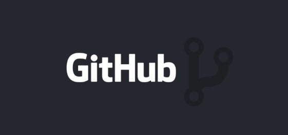
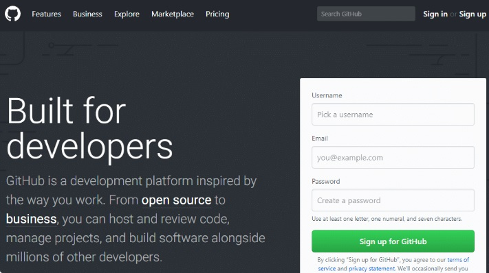

<!-- Encabezado -->
# ¿Qué es GitHub? Una Guía para Principiantes sobre GitHub

Por: **Franklin VH** [franklin_vh@hotmail.com](franklin_vh@hotmail.com)

En un nivel más alto, GitHub es un sitio web y un servicio en la nube que ayuda a los desarrolladores a almacenar y administrar su código, al igual que llevar un registro y control de cualquier cambio sobre este código. Para entender exactamente qué es GitHub, primero usted necesita conocer los dos principios que lo conectan:

* Control de Versión
* GIT

## ¿Qué Es una Versión de Control?
Una Versión de Control ayuda a los desarrolladores llevar un registro y administrar cualquier cambio en el código del proyecto de software. A medida que crece este proyecto, la versión de control se vuelve esencial. Tomemos WordPress por ejemplo.

En este punto, WordPress es un gran proyecto. Si un desarrollador importante deseara trabajar en una parte en específico de la base de datos del código de WordPress, no sería seguro o eficiente permitir que pueda editar directamente sobre el código fuente “oficial”

Por esto, la versión de control permite a los desarrollador trabajar de forma segura a través de una bifurcación y una fusión.

Con la bifurcación, un desarrollador duplica parte del código fuente (llamado repositorio). Este desarrollador, luego puede, de forma segura, hacer cambios a esa parte del código, sin afectar al resto del proyecto.

Luego, una vez que el desarrollador logre que su parte del código funcione de forma apropiada, esta persona podría fusionar este código al código fuente principal para hacerlo oficial.

Todos estos cambios luego son registrados y pueden ser revertidos si es necesario.

## ¿Qué Es Git?
Git es un sistema de control específico de versión de fuente abierta creada por Linus Torvalds en el 2005.

Específicamente, Git es un sistema de control de versión distribuida, lo que quiere decir que la base del código entero y su historial se encuentran disponibles en la computadora de todo desarrollador, lo cual permite un fácil acceso a las bifurcaciones y fusiones.

Según la encuesta entre los desarrolladores de [Stack Overflow](https://insights.stackoverflow.com/survey/2018/#work-version-control), más deé 87% de los desarrolladores usan Git.

## Entonces, ¿Qué Es GitHub?

GitHub es una compañía sin fines de lucro que ofrece un servicio de hosting de repositorios almacenados en la nube. Esencialmente, hace que sea más fácil para individuos y equipos usar Git como la versión de control y colaboración.

La interfaz de GitHub es bastante fácil de usar para el desarrollador novato que quiera aprovechar las ventajas del Git. Sin GitHub, usar un Git generalmente requiere de un poco más de conocimientos de tecnología y uso de una línea de comando.

GitHub es tan fácil de usar, que incluso algunas personas usan GitHub para administrar otro tipo de proyectos – como escribir libros.

Además de esto, cualquier persona puede inscribirse y ser hospedar un repositorio de código público completamente gratuito, el cual hace que GitHub sea especialmente popular con proyectos de fuente abierta.

# GitHub vs. GitLab: vista general de las principales diferencias
| GitHub	 | GitLab |
| ---------- | -------|
| Los elementos se pueden rastrear en varios repositorios | Los elementos no se pueden rastrear en varios repositorios |
| Los repositorios privados exigen la versión de pago | Los repositorios privados se permiten en la versión gratuita |
| No hay opción gratuita de hospedaje en servidor propio | Opción gratuita de hospedaje en servidor propio |
| Integración continua solo mediante herramientas de terceros como Travis CI, CircleCI etc. | Integración continua gratuita incluida |
| No cuenta con plataforma de implementación integrada | Implementación de software a través de Kubernetes |
| Rastreo completo de comentarios | Sin rastreo de comentarios |
| No hay opción de exportación de elementos como archivo CSV | Opción de exportación de elementos como archivo CSV por correo electrónico |
| Panel personal para rastrear elementos y solicitudes pull | Panel de análisis para planificar y supervisar proyectos |
|

*Huancayo, 05 de Junio 2021*

